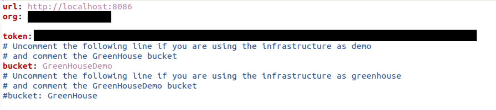
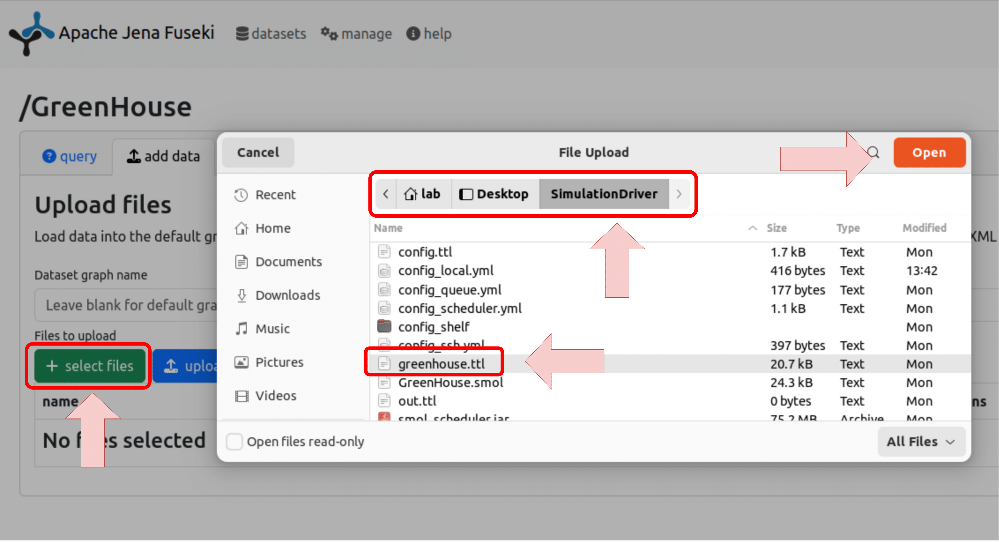

# Greenhouse

The whole simulation driver can be retrieved as a virtual machine here with the following credentials

- username: lab
- password: lab

In addition, it is possible to also manually install the whole system by following the guides for the [frontend](https://github.com/sievericcardo/greenhousedt_frontend) the [simulation driver](https://github.com/sievericcardo/smol_scheduler), and the [physical setup](https://github.com/sievericcardo/greenhouse_dt_project).

The following is on how to **setup the VM**.

## Setting up the environment for Demo purpose

The environment on the Virtual Machine is set up be default to use the demo environment. This will result in:

- using the Demo bucket of the InfluxDB
- use the pre-loaded data from the Demo bucket to display information of the moisture on the graph

## Setting up the environment to use with a GreenHouse

To use the environment with a proper greenhouse, two things has to be done

- set up the proper token for the simulation driver; this can be done from the folder `SimulationDriver` on the Desktop and changing the settings of the `config_local.yml` file
- change the execution mode for the frontend. This can be done from the terminal with `sudo bash change_parameters.sh` and choosing the Operating Mode to either `demo` or `greenhouse`

## Adding the RDF for the execution

To upload the asset model navigate to the page `http://localhost:3030` and click on **Add Data**, from there click on **Select Files**, navigate to `home -> Desktop -> Simulation Driver` and choose the `greenhouse.ttl` if you want to use our asset model, or upload your own if you have a different one. Once you have selected the file click on **Upload Now** to upload the data; if there were no error in the file the bar will be completely green and it will show the number of triples added.

## Executing the project

For the execution the file `execute_simulation.sh` has been added on the Desktop. You just need to execute it with the regular user with

> `./execute_simulation.sh start`

and the status the system will be updated over time on the frontend at `http://greenhousedt.local`. The complete output of the execution can be inspected in the file under `/model/model.txt`

## Extend the GreenHouse

In case of addition of elements the following file has to be modified

- `config_shelf_*`: for each shelf we use a different file and modifications and/or addition has to be added before restarting the system to get the new elements
- the asset model has to be updated with the appropriate query: this can be done on the update seciton on `http://localhost:3030`

For detailed instructions on extending the greenhouse, as well as a detailed description of the two extensions mentioned in the accompanying paper, we refer to the [code documentation](https://github.com/sievericcardo/smol_scheduler/blob/master/demo/) in the repository of the greenhouse.
